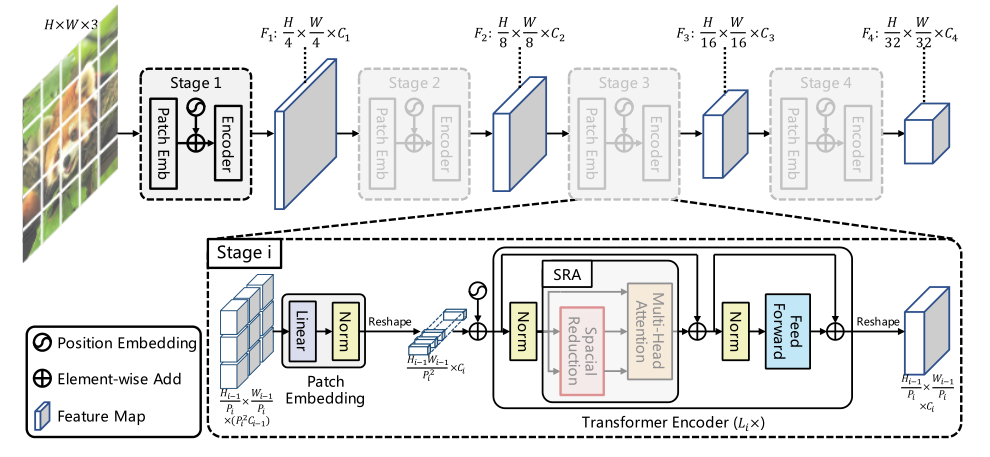
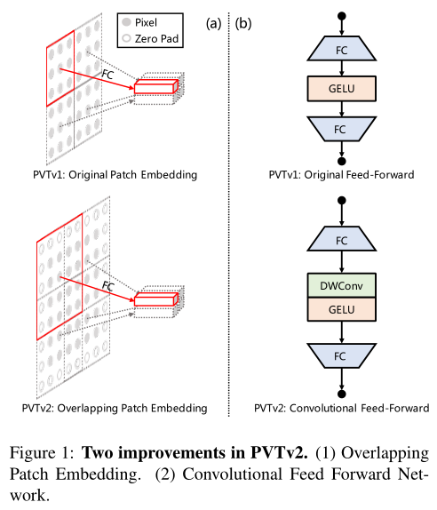
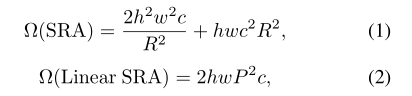

# PVTV2_paddle
reproduction of "PVTv2 Improved Baselines with Pyramid Vision Transformer" in PaddlePaddle   

reference:[https://github.com/whai362/PVT](https://github.com/whai362/PVT)

## 1、简介
  
上图（来自pvt v1）为PVT的网络结构图，该网络可以生成多个不同大小的特征图，用于下游CV任务。PVT v2在PVT v1的基础上，增加了以下3个设计：  
### （1）overlapping patch embedding
  
如上图（a）所示，原始的patch embedding不包含原特征图的重叠区域，overlapping embedding会包含原特征图的重叠区域。  
### （2）convolutional feed-forward networks
如上图（b）所示，在ViT的MLP模块中加入depth-wise convolution。  
### （3） linear complexity attention layers

如上图所示，PVT v2中引入了linear SRA模块，对比PVT v1中的SRA模块，linear SRA可以进一步减少计算量。  

## 2、复现精度
> Light_imagenet（imagenet图片压缩处理）复现结果如下表。


|Model|optimizer|epoches|image_size|batch_size|dataset|accuracy|link|
|:---:|:---:|:---:|:---:|:---:|:---:|:---:|:---:|
|PVT v2|AdamW|300|224x224|1024|Light_ImageNet|78.45%| [model（验证码：qcrq）](https://pan.baidu.com/s/1LyeMZlSVQUg-Pt8s7ohANA)|

## 3、数据集
数据集使用ImageNet 2012的训练数据集，有1000类，训练集图片有1281167张，验证集图片有50000张，大小为144GB，aistudio上的地址为：[https://aistudio.baidu.com/aistudio/datasetdetail/79807]([https://aistudio.baidu.com/aistudio/datasetdetail/79807)，该数据集为压缩后的数据集，复现精度会略低于原数据集。

## 4、环境
- 硬件: Tesla V100 * 4

- 框架:
    - PaddlePaddle == 2.2.1
    
## 5、快速开始
### （1）克隆项目
```bash
git clone https://github.com/justld/PVTV2_paddle.git
```

### （2）安装第三方库
```bash
pip install -r requirements.txt
```

### （3）训练模型
单卡训练(本项目的复现环境是Tesla V100 * 4，单卡训练可能达不到本项目复现的结果)：
```bash
python tools/train.py -c ./ppcls/configs/ImageNet/PVTv2/pvtv2.yaml -o Global.device=gpu 
```
多卡训练:
```bash
python -m paddle.distributed.launch tools/train.py -c ./ppcls/configs/ImageNet/PVTv2/pvtv2.yaml -o Global.device=gpu 
```

### （4） 验证
在验证集测试(单卡)-权重链接在上方表格：
```bash
python tools/eval.py -c ./ppcls/configs/ImageNet/PVTv2/pvtv2.yaml -o Global.pretrained_model=output/stage2/weight/best_model
```

### （5） 预测
模型预测-权重链接在上方表格：
```bash
python tools/eval.py -c ./ppcls/configs/ImageNet/PVTv2/pvtv2.yaml -o Global.pretrained_model=output/stage2/weight/best_model -o Infer.infer_imgs={path to image}
```

## 6、代码结构与说明
本次复现基于[paddleclas](https://github.com/PaddlePaddle/PaddleClas) ，使用方法与paddleclas一致。     
|-images   readme使用的图片  
|-ppcls  
|--arch      网络结构，添加backbone\model_zoo\pvt_v2.py    
|--configs   配置文件，添加configs/ImageNet/PVTv2/pvtv2.yaml   
|--data       
|--engine    
|--loss      
|--metric    
|--optimizer  
|--static     
|--utils      
|--__init__.py    
|-tools       
|-log                     见下方说明    
|--stage1_trainer-0.log   第一阶段训练日志  
|--stage2_trainer-0.log   第二阶段训练日志
|-output                  权重和vdl--output文件需要从百度云下载(验证码:qcrq  https://pan.baidu.com/s/1LyeMZlSVQUg-Pt8s7ohANA)  
|--stage1                 第一阶段最后一个epoch的权重和vdl
|--stage2                 第二阶段acc最高的权重和vdl
|  __init__.py     
|  hubconf.py      
|  paddleclas.py       
|  README.md         
|  requirements.txt    
|  setup.py       

日志说明:  
本次复现使用aistudio脚本任务，脚本任务有72小时运行限制，故训练分2阶段进行，为了加快训练速度，第一阶段的训练eval的间隔为100个epoch，第二阶段eval间隔为1epoch。  
权重说明:  
stage1中保存第一阶段训练最后一个epoch的权重，第二阶段加载第一阶段最后的权重训练，stage2中保存eval的最优权重。  

## 7、模型信息

相关信息:

| 信息 | 描述 |
| --- | --- |
| 作者 | 郎督|
| 日期 | 2022年1月 |
| 框架版本 | PaddlePaddle==2.2.1 |
| 应用场景 | 图像分类 |
| 硬件支持 | GPU |
| 在线体验 | [notebook](https://aistudio.baidu.com/aistudio/projectdetail/3383424?contributionType=1), [Script](https://aistudio.baidu.com/aistudio/clusterprojectdetail/3371527)|


